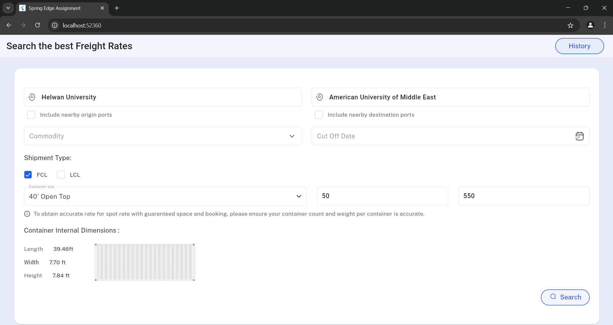

# Spring Edge Assignment – Web Page Design with Auto-complete Feature

This project was part of an assignment task where I was required to:

- Design and implement a **web page screen** using **Flutter**.
- Integrate an **auto-complete text field** using the given API endpoint.
- Ensure responsive design and modern UI/UX best practices.

---

## 🛠️ Features

- ✨ Clean and responsive web UI built with Flutter
- 🔍 Auto-complete search feature
- 📱 Fully responsive layout
- 🖱️ Hover states and material-compliant styling

---

## 📡 API Used

- **Universities API** – [Hipolabs](http://universities.hipolabs.com/)
- Returns a list of universities based on the name query string.

---

## 📸 Screenshots

| UI Preview |
|------------|
|  |

## 🎥 Demo Video

👉 [Click here to watch the demo](https://drive.google.com/file/d/1zpXhFaDi8Ds-VurVg18HyDUouQNquwC-/view?usp=sharing)

---

